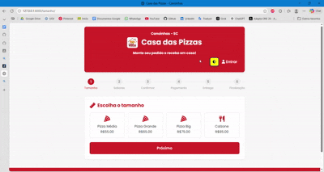
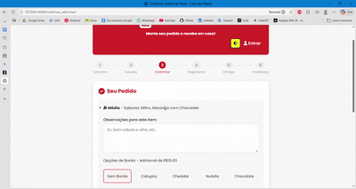

# 🍕 Casa das Pizzas - Sistema de Pedidos Online

Uma plataforma web moderna e acessível para gestão de pedidos de pizzaria, focada na experiência do usuário e na facilidade de fechamento de pedidos via dispositivos móveis e desktop.

---

## 📺 Demonstração das Funcionalidades

### 1. Fluxo de Identificação e Seleção
Navegação intuitiva desde o acesso, cadastro de novos clientes até a escolha técnica do produto (tamanhos e sabores).



### 2. Finalização e Integração com WhatsApp
Processo de revisão minuciosa, escolha de pagamento, endereço e o envio automatizado dos dados formatados para o WhatsApp do estabelecimento.



---

## ♿ Acessibilidade e Inclusão
O projeto foi desenvolvido seguindo boas práticas de acessibilidade para garantir que todos os usuários possam realizar seus pedidos de forma independente:

- **Alto Contraste**: Modo visual otimizado para usuários com baixa visão.
- **Navegação por Teclado**: Foco visível e ordem lógica de tabulação para usuários que não utilizam mouse.
- **Semântica HTML**: Uso correto de tags para compatibilidade com leitores de tela.


---

## 🚀 Funcionalidades Principais

- **Autenticação Flexível**: Login utilizando CPF ou Telefone para maior comodidade.
- **Personalização de Produto**: 
  - Pizzas com até 3 sabores.
  - Calzones com 1 sabor específico.
  - Seleção de bordas recheadas e campos de observações por item.
- **Gestão de Carrinho**: Adição de múltiplos itens no mesmo pedido com persistência via Cookies.
- **Check-out Inteligente**:
  - Opção de entrega ou retirada no balcão.
  - Validação de dados (CPF brasileiro e telefones).
  - Integração direta com a API do WhatsApp.

---

## 📩 Padrão de Mensagem (WhatsApp)
O sistema gera automaticamente uma mensagem estruturada para evitar erros de interpretação na cozinha:

```text
Olá, me chamo Alessandra Leite!

*Detalhes do Pedido 1*
- Pizza Média
- Sabores: Milho com Bacon, Mignon com Cebola Caramelizada, Conffeti
- Borda: Sem Borda
- Observações: Nenhuma

*Detalhes Gerais*
- Valor da(s) Pizza(s): R$ 55.00
- Pagamento: Pix
- Endereço: Retirar no balcão
```

---

## 🛠️ Tecnologias Utilizadas

- **Core**: Django 5.x
- **Database**: SQLite (Desenvolvimento)
- **Front-end**: JavaScript (Vanilla), CSS3 (Custom Properties), Font Awesome.
- **Integração**: WhatsApp Web URL API.

---

## 🔧 Instalação e Setup

1. **Clone o repositório:**
   ```bash
   git clone https://github.com/AlessaLeit/piWebSenac.git
   cd piWebSenac
   ```

2. **Configure o ambiente virtual:**
   ```bash
   python -m venv venv
   source venv/bin/activate  # Windows: venv\Scripts\activate
   ```

3. **Instale as dependências:**
   ```bash
   pip install -r requirements.txt
   ```

4. **Migrações e Execução:**
   ```bash
   python manage.py migrate
   python manage.py runserver
   ```

Acesse: `http://127.0.0.1:8000`

---

## 🗂️ Arquitetura de Dados

- **Usuario**: Modelo estendido do Django para suportar CPF (único), telefone e endereço padrão.
- **Cookies de Sessão**: Utilizados para manter o estado do pedido antes da finalização, garantindo performance e menos requisições ao banco.

---
© 2025 Casa das Pizzas - Desenvolvido por Alessandra Leite
